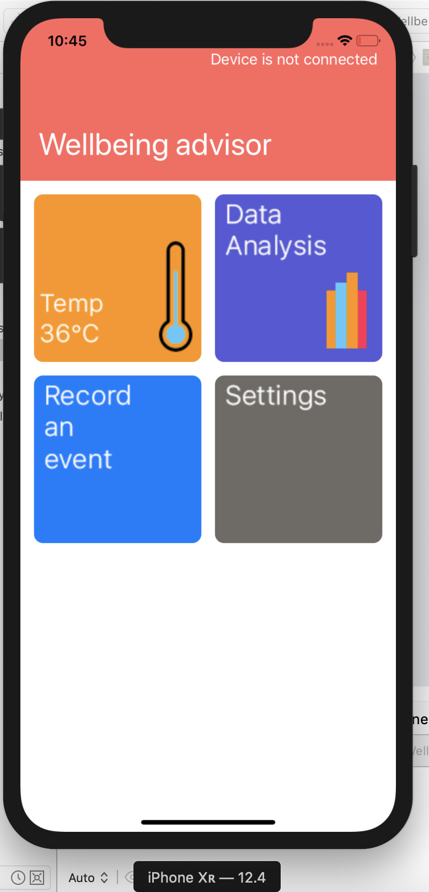

# Wellbeing Advisor

The wellbeing advisor will be built natively in IOS using Xcode by following some tutorial online. This allows me to learn first hand from developers on the correct way to develop the app. The hope is that I become more proficient in coding in swift/objective c.

## Purpose

As I have recently got a Huawei smartwatch and have found the application "Huawei health" to lack functionality, I hope to see what information is collected from the respective sensors and explore what sort of data values I can get for personal benefit.

Another plus of this is it gives me the ability to develop my first native IOS app.

* Feature sets to implement

  * Bluetooth connectivity from the wearable device to the app.
  * Populate data from sensors in a graph-like structure.
  * Push information from sensors to the cloud.
  * Responsive design to work with different iPhone screen sizes.
  * Other features will be added to the list as required.
